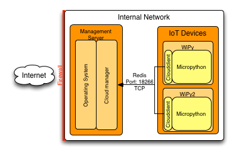

Design
======

Cloudmanager uses a central management hub that accepts connections from clients and relays requests from the management API to the clients.

All incoming connections flow through the management hub, the micropython client connects to the management hub and receives commands through that connection.

